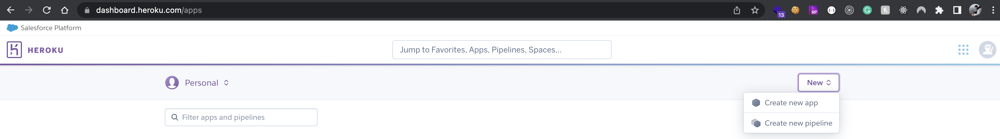
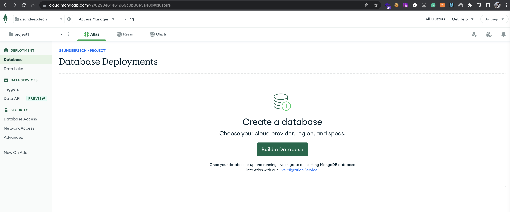
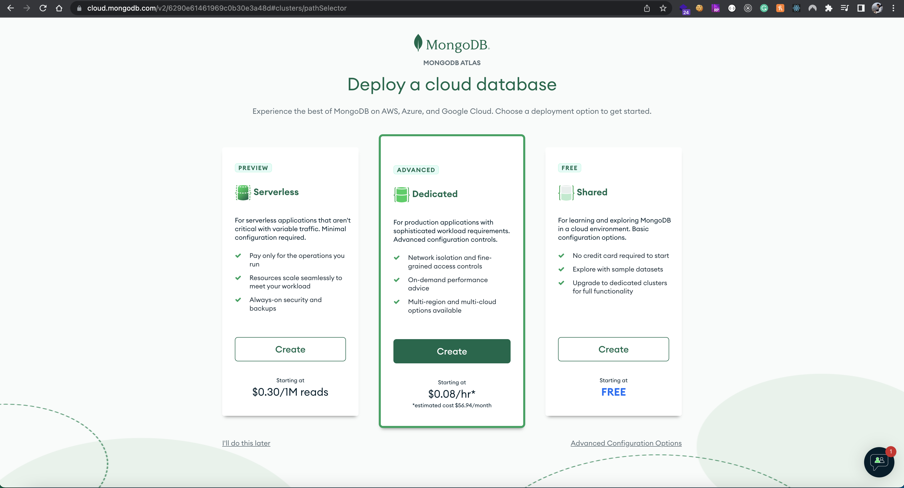
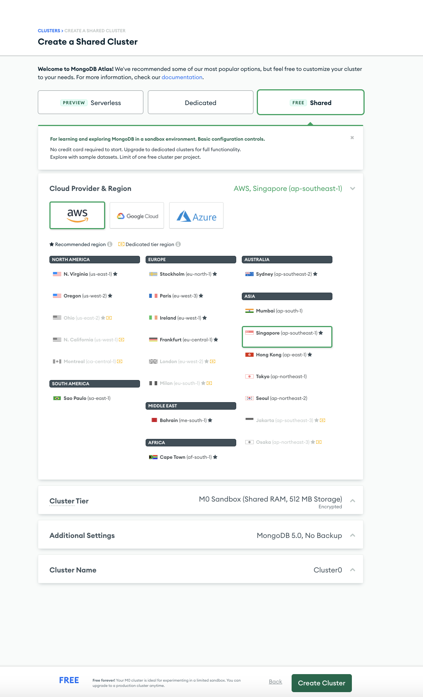

# CI CD Setup for Node JS Application
[Table of Contents](#table-of-contents)
1. [Application Architecture](#application-architecture)  
    * [Setup Heroku Account](#setup-heroku-account)  
    * [Configuring MongoDB Atlas](#configuring-mongodb-atlas)  
    * [Configuring Docker Image](#configuring-docker-image) 
    * [Run the application in local](#run-the-application-in-local)  
2. [CI CD Setup](#ci-cd-setup)
    * [Workflows](#workflows)  
    * [Eslint Checks](#eslint-checks)  
    * [Integration tests](#integration-tests)  
    * [Sonarqube checks](#sonarqube-checks)  
    * [Deployment to heroku](#deployment-to-heroku)  
3. [TODO](#todo)

# Application Architecture
A Simple node js application containing the following routes.

* GET /health - to check the health of the application  
* POST /audio/upload - to upload the audio files into the application
* POST /audio/metadata - to store the metadata information related to audio files

Application is deployed in the [Heroku cloud platform](https://www.heroku.com/)  and it uses MongoDB is database which is hosted on the [MongoDB Atlas cluster](https://www.mongodb.com/cloud-database/benefits) for storing the data

Mocha is added to execute the unit test cases and eslint dependency is helpful in maintaining the better coding standards

Please follow through this readme file to understand the complete setup of CI and CD and deployment of application.

## Setup Heroku Account

Following steps are required to setup the heroku account for building the CI-CD Pipeline.  
* Login into the [Heroku platform](https://www.heroku.com/) if already registered otherwise create an account in the platform
* Create a new app, for this example repo, I have created an app name "ci-cd-sundeep" 
* Go to your Account settings -> API Key and copy the API key which will be used futher in configuring the CI-CD pipeline  

## Configuring MongoDB Atlas

* Login into [MongoDB Cloud](https://www.mongodb.com/atlas) if already registered otherwise create an account
* create a new project and build a database   
    * Select the cloud db tier you want to use, In this example I'm going with the shared (free) tier  
    * Select the cloud provider and region, cluster tier, additional settings and cluster name (default options are fine)  
    * Configure the DB security, add a username and password for accessing the DB and also configure which IP's are allowed to access the DB. To provide access to all the IP's you can use the 0.0.0.0/0 as the value 
    * Get the connection string by clicking on the connect button 
    Note: this connection string will be configured in the github workflow secrets. Make sure application reads the DB connection string via Env 

Till now we have configured/setup accounts so that we have a platform where we can deploy the application and a cloud DB to connect with. 

## Configuring Docker Image
We'll be deploy the node js application as a docker container. So we need to provide the Dockerfile for Heroku. [Dockerfile](./Dockerfile) for this application is pretty straight forward. I have added some explanation for the following Dockerfile lines 

* Line 11: In the Dockerfile is used by the Heroku and we need to pass it as a variable so that Heroku can assign the exposing port at run time
* Line 13: start CMD is listed in the [package.json](./package.json) scripts section.

## Run the application in local
Using the docker file that we have created in the earlier step we can run the application in local. Make sure mongoDB is also running in local before launching the application.

Following the steps to build the image and run the application

* Building the image: docker build -t ci-cd:local -f Dockerfile .
* Running the image: docker run --name ci-cd-container -p 3000:3000 -e PORT=3000 ci-cd:local  

# CI CD Setup

In this example we are using the [Github Workflows](https://docs.github.com/en/actions/using-workflows) for setting up our CI CD pipeline. 

## Workflows
Using the github actions, I have created two workflows.  
* [First workflow](.github/workflows/ci.yml) will run the Continous integration steps when a PR is raised against the main branch or when a commit is happend in the PR.
    * Continous Integration contains the steps/checks for linting, unit tests and integration tests. 
    * [Sonarqube](https://sonarcloud.io/) is also integrated to check for the code coverage, outdated/vulnerable libraries checks and code smells.
    * A sample PR looks like the following 
* [Second workflow](.github/workflows/main.yml) is for deploying the application when the PR or commit is merged into the main branch. There are two steps perfomed in this workflow.  
    * First step performs the continous integration which checks for linting, unit tests and integration tests. 
    * Second step performs the Deployment of application into the Heroku 

## Eslint Checks
We have used the eslint to check if the code is in the required standards. 
* [Continous Integration](.github/workflows/ci.yml) workflow line 33 has the linting checks command. npm run lint command is configured in the [package.json](./package.json) scripts section

We need to have a eslint configuration as well and that can be found in [.eslintrc.json](.eslintrc.json) file

## Integration tests
We are executing the integration tests for node js api using the mocha. To run the integration tests, we need to make sure the application is running. In the Continous Integration we have achieved this via following steps
* Running the mongoDB docker container, this is coded in line 37 of [Continous Integration](.github/workflows/ci.yml) workflow
* Executing the integration tests requiring to build and start the application. Once the tests are completed, we are killing all the applications listening on the specific port. this is coded in the line 47 of [Continous Integration](.github/workflows/ci.yml) workflow

## Sonarqube checks
Sonarqube can be configured via [sonarcloud](https://sonarcloud.io/). Sonarqube is used in indetifying the code coverage, code smells and outdated/vulnerable libraries.  
Note: This is only available for the public repo's

## Deployment to heroku
Using this [github action](https://github.com/marketplace/actions/deploy-to-heroku), we'll be deploying our docker image to Heroku. Following configuration is required.
* Add the Heroku Deployment step in the [workflow](.github/workflows/main.yml). this is coded in line 62. This github action requeries the following inputs
    * heroku_api_key - this can be found from the [Setup Heroku Account](#setup-heroku-account) step
    * heroku_app_name - this can be found from the [Setup Heroku Account](#setup-heroku-account) step
    * heroku_email - use the registered email
    * usedocker - mentions that we want to deploy the application via docker. Note: Once the application is deployed via docker we can't deploy the application normally we are forced to the docker way of deployment
    * docker_build_args - contains the env values that we want to pass. In this case we are passing the MongoDB Cloud DB URI.
* All the values are retrieved from the [github secrets](https://docs.github.com/en/actions/security-guides/encrypted-secrets) 

# TODO

Following are the additional steps we can handle to make the application production ready
* Staging and Production Deployments
* unit tests
* Github account settings like restricting access to direct merge to main branch and reviews for PR
